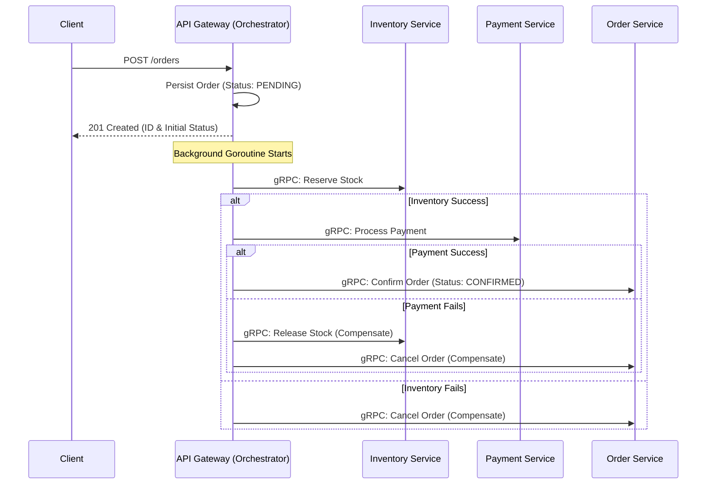

# Ecommerce Saga Orchestration Engine

A high-performance, distributed transaction system built in Go, demonstrating the **Saga Orchestrator** pattern. This project serves as a technical showcase for scalable microservices architecture, featuring "exactly-once" semantics via idempotency, robust observability, and contract-first gRPC communication.

[](https://golang.org)
[](https://grpc.io)
[](https://opentelemetry.io)
[](https://opensource.org/licenses/MIT)

---

## 🏗 Architecture & Design Decisions

### Asynchronous Distributed Transactions: Saga Orchestrator
In a distributed system, maintaining atomicity across microservices is a challenge. This project implements a **non-blocking Saga Orchestration** pattern to optimize User Experience and system throughput:

- **Decoupled Lifecycle**: The API Gateway acknowledges the request immediately after persisting a `PENDING` order, returning a `201 Created` response.
- **Goroutine-based Processing**: The orchestration logic is offloaded to a background goroutine. We utilize `context.WithoutCancel(r.Context())` to ensure the Saga completes its lifecycle even if the initial HTTP client disconnects.
- **Centralized Logic**: The Orchestrator manages the global state and complex business workflows, making it easier to reason about the system compared to event-based choreography.

#### The Transaction Flow
The orchestrator executes a sequence of "Local Transactions". If a step fails, it triggers **Compensating Actions** in LIFO (Last-In, First-Out) order to restore system consistency.



### High-Performance Communication: gRPC & Protobuf
The services communicate internally using **gRPC** instead of REST/JSON.
- **Binary Serialization**: Protobuf provides significantly smaller payloads and faster serialization/deserialization than JSON, reducing CPU overhead.
- **Strongly Typed Contracts**: Protobuf files serve as the single source of truth for service interfaces, ensuring compile-time safety and reducing integration bugs.
- **HTTP/2**: Leverages multiplexing and header compression for lower latency and better throughput.

### State Integrity: Idempotency & Redis
To achieve "exactly-once" processing in an unreliable network, every write operation is guarded by an **Idempotency Layer**.
- **Strategy**: Uses a `X-Idempotency-Key` provided by the client.
- **Redis Integration**: Redis serves as a distributed, high-speed lock. A "fast-path" check prevents duplicate execution within a TTL window.
- **Local Fallback**: An in-memory cache provides an additional safety layer to handle transient Redis failures without compromising consistency.

### Durable Saga Log
Every state transition is persisted in a **Durable Saga Log** (SQLite in WAL mode). This log correlates the business transaction ID with the **OTel Trace ID**, creating a bridge between database audits and distributed traces for seamless root-cause analysis.

---

## 🕵️‍♂️ Observability: Solving the "Black Box"

The primary challenge of microservices is visibility. This project implements a full **OpenTelemetry (OTel)** stack to transform the "Black Box" into a transparent system.

- **Distributed Tracing**: Automated context propagation (`traceparent`) across HTTP/gRPC boundaries. Using **Tempo**, we can visualize the entire lifecycle of a request, including network latency and internal logic.
- **Correlated Logs**: Distributed logs are enriched with Trace IDs, allowing developers to pivot from a specific database audit entry directly to its corresponding trace in Grafana.
- **Metrics**: High-cardinality metrics are collected via Prometheus, providing real-time visibility into Saga success/failure rates and service health.

---

## 🛠 Tech Stack

| Layer | Technology |
|---|---|
| **Language** | Go 1.24+ (Generics, `slog`, `ctx.WithoutCancel`) |
| **Transport** | gRPC / Protocol Buffers (Internal), HTTP/JSON (External) |
| **State & Cache** | Redis (Idempotency), SQLite (Saga Log) |
| **Frameworks** | Chi (HTTP Routing), gRPC-go |
| **Observability** | OpenTelemetry, Prometheus, Tempo, Grafana |
| **DevOps** | Docker, Docker Compose |

---

## 🚀 Getting Started

### 1. Requirements
- Docker & Docker Compose
- `curl` or any API client

### 2. Launch the Stack
```bash
docker compose up --build
```

### 3. Monitoring Dashboards
- **Grafana**: [http://localhost:3000](http://localhost:3000) (Traces, Metrics, Dashboards)
- **Prometheus**: [http://localhost:9090](http://localhost:9090) (Raw Metrics)
- **API Gateway**: [http://localhost:8080](http://localhost:8080)

### 4. Integration Testing
**Success Path (Purchase Flow):**
```bash
curl -X POST http://localhost:8080/orders \
  -H "Content-Type: application/json" \
  -H "X-Idempotency-Key: task-001" \
  -d '{
    "customer_id": "cust_123",
    "items": [{"product_id": "prod_1", "quantity": 1, "price": 50.00}]
  }'
```

**Compensation Path (Trigger Rollback):**
Trigger a failure at the payment step (amount > $500).
```bash
curl -X POST http://localhost:8080/orders \
  -H "Content-Type: application/json" \
  -H "X-Idempotency-Key: fail-001" \
  -d '{
    "customer_id": "cust_123",
    "items": [{"product_id": "prod_1", "quantity": 1, "price": 600.00}]
  }'
```

---

## 📄 License
Detailed license information is available in the [LICENSE](LICENSE) file. (MIT)
