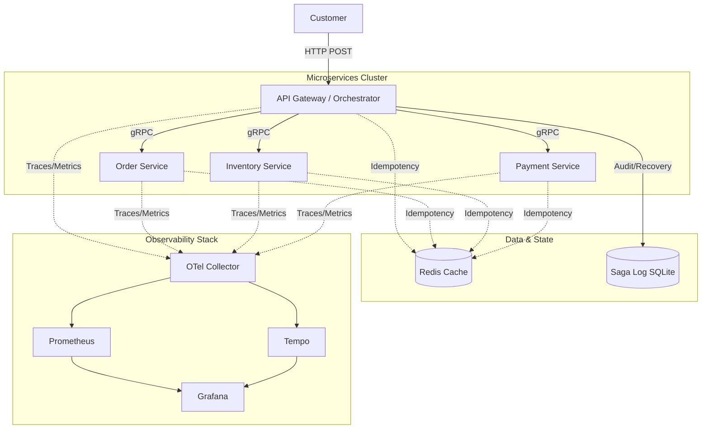

# ecommerce-sagas

A comprehensive learning project demonstrating the **Saga Orchestration** pattern in a Go microservices architecture, featuring Distributed Tracing, Metrics, and a durable Saga Log.


## 🏗 Architecture

The system consists of four domain services communicating over gRPC, coordinated by an API Gateway. It uses a robust observability stack and a durable log for the orchestration state.



## 🚀 Getting Started

### Prerequisites
- Docker & Docker Compose
- Go 1.24+ (optional, for local development)

### One-Command Start
Run the entire stack (apps + transparency tools):

```bash
docker compose up --build
```

### 🔍 Access the Dashboards

Once running, access the following services:

| Service | URL | Description |
|---|---|---|
| **Grafana** | [http://localhost:3000](http://localhost:3000) | **Main Dashboard**. View Traces & Metrics. (No login required) |
| **Prometheus** | [http://localhost:9090](http://localhost:9090) | Raw metrics and query explorer. |
| **API Gateway** | [http://localhost:8080](http://localhost:8080) | The entry point for your requests. |

> **Tip:** In Grafana, go to **Explore**, select the **Tempo** datasource, and verify traces are arriving. Or check the pre-provisioned dashboards.

---

## 🧪 How to Use

### 1. Happy Path: Create a Successful Order
Creates an order, reserves stock, and processes payment.

```bash
curl -X POST http://localhost:8080/orders \
  -H "Content-Type: application/json" \
  -H "X-Idempotency-Key: unique-key-001" \
  -d '{
    "customer_id": "cust_123",
    "items": [
      {"product_id": "prod_1", "quantity": 2, "price": 50.00},
      {"product_id": "prod_2", "quantity": 1, "price": 30.00}
    ]
  }'
```

### 2. Failure Path: Trigger a Saga Rollback
Fails at the Payment step (Amount > $500), triggering compensation (Stock Release + Order Cancellation).

```bash
curl -X POST http://localhost:8080/orders \
  -H "Content-Type: application/json" \
  -H "X-Idempotency-Key: unique-key-fail-002" \
  -d '{
    "customer_id": "cust_456",
    "items": [
      {"product_id": "prod_1", "quantity": 1, "price": 600.00}
    ]
  }'
```

### 3. Check Order Status
```bash
# Replace {order_id} with the ID returned from the creation step
curl http://localhost:8080/orders/{order_id}
```

---

## 🧩 Key Patterns Implemented

### 🔄 Saga Orchestration
The **API Gateway** acts as the Orchestrator. It executes steps sequentially:
1.  **Inventory**: Reserve Stock
2.  **Payment**: Charge
3.  **Order**: Confirm

If any step fails, it executes **Compensating Actions** in reverse order (e.g., Refund Payment, Release Stock, Cancel Order).

### 🛡 Idempotency
Every write operation (Reserve, Charge, Create) is idempotent.
-   **Implementation**: Uses **Redis** as a fast-path lock and in-memory maps as a fallback.
-   **Header**: `X-Idempotency-Key` ensures safe retries.

### 📝 Saga Log (Audit & Recovery)
A durable log of every state transition is stored in **SQLite** (WAL mode).
-   **Purpose**: Debugging and recovering crashed sagas.
-   **Correlation**: Each log entry includes the **Trace ID**, linking the database row directly to the OTel distributed trace.

### 🕵️‍♂️ Distributed Tracing (OpenTelemetry)
Trace context (`traceparent`) is propagated automatically across HTTP and gRPC boundaries.
-   **Logs correlation**: `slog` logs are correlated with Trace IDs.
-   **Visualisation**: View the full request lifecycle in **Grafana Tempo**.

---

## 📂 Project Structure

```bash
.
├── cmd/                    # Main entry points
│   ├── api-gateway/        # Orchestrator & HTTP Server
│   ├── order-service/      # gRPC Service
│   ├── inventory-service/  # gRPC Service
│   └── payment-service/    # gRPC Service
├── internal/
│   ├── coordinator/        # Saga Logic & Steps definition
│   │   └── sagalog/        # SQLite Repository for Saga Audit
│   ├── pkg/                # Shared libs (Interceptor, Redis, OTel)
│   └── ...                 # Domain logic per service
├── observability/          # Configs for OTel, Prometheus, Tempo, Grafana
└── docker-compose.yml      # Orchestration of all services
```
